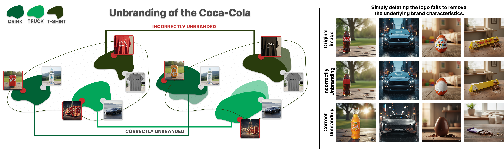

# From Unlearning to UNBRANDING: A Benchmark for Trademark‑Safe Text‑to‑Image Generation


[](https://arxiv.org/abs/2512.13953)
[](https://gmum.github.io/UNBRANDING/)
[](https://gmum.github.io/UNBRANDING)



> Benchmark and task for trademark‑safe text‑to‑image generation. We introduce unbranding — fine‑grained removal of both explicit logos and implicit trade‑dress while preserving object and scene semantics — together with a dataset and a VLM‑QA evaluation protocol.


## Authors
Dawid Malarz, Artur Kasymov, Filip Manjak, Maciej Zięba, Przemysław Spurek

## Abstract
Modern text‑to‑image diffusion models can faithfully reproduce trademarks. Prior unlearning works target general concepts (e.g., styles, celebrities) and miss brand‑specific identifiers. Brand recognition is multi‑dimensional, spanning explicit logos and distinctive structural features (e.g., a car’s front grille). We define unbranding as the fine‑grained removal of both trademarks and subtle trade‑dress while preserving semantic coherence. We introduce a benchmark dataset and a VLM‑based QA metric that probes for both explicit and implicit brand signals, going beyond classic logo detectors. Our analysis shows newer models tend to synthesize brands more readily, underscoring the urgency of unbranding. Results validated by our metric indicate that unbranding is a distinct, practically relevant problem requiring specialized techniques.

## Highlights
- Task: fine‑grained removal of brand identifiers while preserving object fidelity.
- Benchmark: dataset spanning explicit logos and trade‑dress cues.
- Metric: VLM‑based QA probing both explicit and implicit brand signals.
- Motivation: newer models (e.g., SDXL, FLUX) reproduce brands more readily than older ones.

## Results Snapshot
Trade‑off between fidelity and removal. Baseline preserves structure but often fails to remove brands; ESD removes brands but alters semantics. Effective unbranding must achieve both.


## Installation

### Prerequisites
- Python 3.10
- CUDA-compatible GPU (for image generation and VLM inference)
- [uv](https://docs.astral.sh/uv/) package manager

### Setup with uv

1. Clone the repository:
```bash
git clone https://github.com/gmum/UNBRANDING.git
cd UNBRANDING
```

2. Install dependencies using uv:
```bash
uv sync
```

This will create a virtual environment in `.venv` and install all required packages including:
- PyTorch 2.8.0 with CUDA support
- Diffusers 0.35.2 (Stable Diffusion, FLUX models)
- Transformers 4.57.1 (HuggingFace models)
- VLLM 0.11.0 (optimized VLM inference)
- Streamlit 1.51.0 (annotation UI)
- Ray 2.51.1 (distributed processing)

3. Activate the environment:
```bash
source .venv/bin/activate
```

Or run commands directly with uv:
```bash
uv run python <script.py>
```

## Quick Start

### 1. Download Prompt Data from Hugging Face

Dataset (CSV prompts): `MalarzDawid/UNBRANDING`

```bash
uv run huggingface-cli download MalarzDawid/UNBRANDING \
  --repo-type dataset \
  --local-dir data/hf_unbranding \
  --local-dir-use-symlinks False
```

The main prompt file used below is:

```bash
data/hf_unbranding/train.csv
```

### 2. Generate Images

`generate_images.py` expects `--prompts_file` (CSV) and saves outputs under `--output_dir`.

```bash
# SDXL
uv run python generate_images.py \
  --model sdxl \
  --prompts_file data/hf_unbranding/train.csv \
  --prompt_set directed biased \
  --output_dir output/sdxl \
  --seed 42

# FLUX.1 Schnell
uv run python generate_images.py \
  --model flux1-schnell \
  --prompts_file data/hf_unbranding/train.csv \
  --prompt_set directed biased \
  --output_dir output/flux1_schnell \
  --seed 42

# SD 3.5 Large
uv run python generate_images.py \
  --model sd35-large \
  --prompts_file data/hf_unbranding/train.csv \
  --prompt_set directed biased \
  --output_dir output/sd35_large \
  --seed 42
```

Supported `--model` values:
- `sd14`
- `sdxl`
- `sd35-large`
- `flux1-schnell`
- `flux1-dev`
- `qwen-image`

### 3. Production Run (SLURM: sbatch + shell wrappers)

#### 3.1 Brand classification benchmark (single image mode)

```bash
bash slurm/submit_eval_brand_for_configs.sh \
  Qwen/Qwen3-VL-8B-Thinking \
  configs/vlm_brand_benchmark.json \
  data/eval_halucination/eval_yes_brands
```

#### 3.2 Comparison benchmark (data + reference images)

`reference-dir` must contain files with the same names as `data-dir`.

```bash
VLM_CONFIG=configs/vlm_vss.json \
DATA_DIR=data/unbrand_images/sdxl-esdx-unbrand \
REFERENCE_DIR=data/unbrand_images/sdxl-base \
RESULTS_DIR=results/eval_brand_benchmark/vss/sdxl_base_vs_esdx \
CLIP_COSINE_THRESHOLD=0.8 \
bash slurm/submit_eval_brand_benchmark.sh Qwen/Qwen3-VL-8B-Thinking
```

Optional scaling for bigger models:

```bash
GPUS_PER_JOB=2 TENSOR_PARALLEL_SIZE=2 \
bash slurm/submit_eval_brand_benchmark.sh Qwen/Qwen3-VL-8B-Thinking
```

### 4. Development Run (manual, 2 terminals)

#### Terminal A: start vLLM server

Detection config (`configs/vlm_brand_benchmark.json`, 1 image per request):

```bash
uv run vllm serve Qwen/Qwen3-VL-8B-Thinking \
  --host 0.0.0.0 \
  --port 8000 \
  --trust-remote-code \
  --limit-mm-per-prompt '{"image":1}'
```

Comparison config (`configs/vlm_vss.json`, 2 images per request):

```bash
uv run vllm serve Qwen/Qwen3-VL-8B-Thinking \
  --host 0.0.0.0 \
  --port 8000 \
  --trust-remote-code \
  --limit-mm-per-prompt '{"image":2}'
```

#### Terminal B: run benchmark client

Detection mode:

```bash
uv run python eval_brand_benchmark.py \
  --model-id Qwen/Qwen3-VL-8B-Thinking \
  --data-dir data/eval_halucination/eval_yes_brands \
  --vlm-config configs/vlm_brand_benchmark.json \
  --server-url http://127.0.0.1:8000 \
  --results-dir results/eval_brand_benchmark/dev_detect
```

Comparison mode:

```bash
uv run python eval_brand_benchmark.py \
  --model-id Qwen/Qwen3-VL-8B-Thinking \
  --data-dir data/unbrand_images/sdxl-esdx-unbrand \
  --reference-dir data/unbrand_images/sdxl-base \
  --vlm-config configs/vlm_vss.json \
  --clip-cosine-threshold 0.8 \
  --server-url http://127.0.0.1:8000 \
  --results-dir results/eval_brand_benchmark/dev_vss
```

Results are saved as JSONL files in `--results-dir` (or in `--output-jsonl` if provided).


## Citation
Please cite our work if you find it useful:

```
@misc{malarz2025unlearningunbrandingbenchmarktrademarksafe,
  title={From Unlearning to UNBRANDING: A Benchmark for Trademark-Safe Text-to-Image Generation},
  author={Dawid Malarz and Artur Kasymov and Filip Manjak and Maciej Zięba and Przemysław Spurek},
  year={2025},
  eprint={2512.13953},
  archivePrefix={arXiv},
  primaryClass={cs.CV},
  url={https://arxiv.org/abs/2512.13953},
}
```

## Acknowledgments
The project page is adapted from the Academic Project Page Template (inspired by Nerfies). Images in this repository are for research/illustration.
